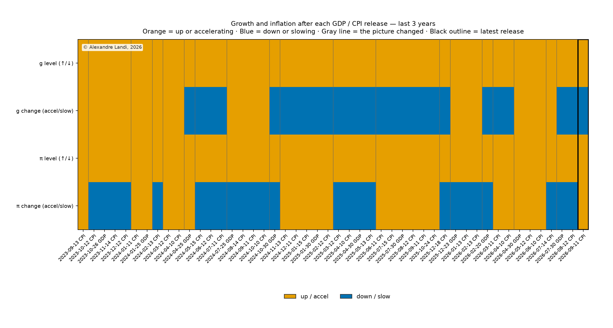

# Reading the growth–inflation map

*Educational brief · Alexandre Landi · as of 20 September 2026*

## Summary

Markets behave differently when growth and inflation are rising than when they
are falling. This note sorts recent history into simple **regimes** —
combinations of whether US growth and inflation are up or down, and whether
each is speeding up or slowing down — and then shows how equities, bonds,
commodities, and cash have tended to perform in each state.

**How we classify each day.** We use the growth and inflation figures **as first
published** on release mornings, not the revised numbers that appear in today’s
databases.

- **Why first prints?** Agencies revise GDP (and, to a lesser extent, CPI) as
more information arrives. Using today’s revised path can assign 2008 or 2022
to a regime that nobody could have diagnosed at the time. First prints keep
the historical labels aligned with what was knowable then.
- **Why not “beat or miss” vs consensus?** Another approach asks whether the
print surprised the median forecast. That answers a different question and
depends on a survey history that is shorter and harder to standardize. Here
we stay with **realized** growth and inflation — whether they are rising or
falling in the data — and state that choice explicitly.

**Where we are now.** Growth is still positive but **slowing**; inflation is
still positive and **edging higher**. In plain terms: the expansion continues,
the growth pulse is softening, and inflation pressure has ticked up again.
Simply asking whether growth and inflation are positive is almost always “yes”
in this sample (about nine days in ten), so the more useful question is whether
they are **accelerating or slowing**.

**Next scheduled releases** (US, 8:30 a.m. Eastern; dates from BLS / BEA
calendars):

| Release                | Date                  | What it covers                                     |
| ---------------------- | --------------------- | -------------------------------------------------- |
| GDP — third estimate   | **30 September 2026** | Q2 2026 (may revise the growth rate we hold today) |
| Consumer Price Index   | **14 October 2026**   | September 2026 inflation                           |
| GDP — advance estimate | **29 October 2026**   | Q3 2026 (first look at the new quarter)            |

The regime label updates after each print; until then, the current reading
stands.

**How to read the charts.** Prefer the view that combines the level of each
rate with its change (the joint heatmaps), or at least the accelerating /
slowing view. On the heatmaps, **g** is growth (real GDP YoY) and **π** is
inflation (headline CPI YoY) — short labels borrowed from standard macro
notation. For each lens we show three panels, all on **daily excess
returns versus cash** (each day’s asset return minus that day’s T-bill return):
**average excess return**, **volatility of excess**, and **Sharpe**
(mean(excess) ÷ sd(excess), annualized). Colors for return and Sharpe run
**blue (weaker / lower) ↔ orange (stronger / higher)**; volatility uses a
light-to-orange scale (always non-negative). Return and volatility numbers are
annualized percent; Sharpe is unitless. Cash is the funding leg only (not
shown as an asset column on the heatmaps).

---

## Where we are in more detail

|                          | Level of the rate    | Is the rate speeding up or slowing? | Previous YoY first print | Latest YoY first print  | Last release      |
| ------------------------ | -------------------- | ----------------------------------- | ------------------------ | ----------------------- | ----------------- |
| Growth (real GDP)        | Positive (expanding) | Slowing                             | about 2.7% (Q1 advance)  | about 2.1% (Q2 advance) | 30 July 2026      |
| Inflation (headline CPI) | Positive             | Accelerating                        | about 3.3% (July)        | about 3.4% (August)     | 11 September 2026 |

**Current regime in short:** expanding but slowing growth, with inflation still
positive and accelerating. That joint combination has occurred on **1,721** of
**8,385** labeled trading days since the mid-1990s (**about 21%** of the
sample). On the heatmaps below, **today’s row is outlined in black** on every
view (rate signs, accelerating/slowing, and joint).

### How that picture evolved (last three years)

Each column is a GDP or CPI first print. The four rows are the same questions
as in the table above: whether growth and inflation are up or down, and whether
each is accelerating or slowing. Orange = up / accelerating; blue = down /
slowing. Gray lines mark when the four-way state changes; the black outline is
the latest release.

---

## How the regimes are defined

We ask two questions for growth and two for inflation:

1. Is the year-over-year **rate** positive or negative?
2. Relative to the previous print, is that rate **rising or falling**?

Crossing those answers gives a small set of states. The most informative
pictures for asset behaviour are usually:

- **Accelerating vs slowing** for growth and inflation, and
- The **joint** view that keeps both the sign of the rate and whether it is
speeding up or slowing.

The four-box growth × inflation *geometry* is familiar from Bridgewater’s
*All Weather* writing (Bridgewater Associates, 2012). Those frameworks often
date regimes off **surprises relative to expectations**. Our dating uses
**realized first prints** — a related idea with a different rule.

**Data note.** Growth and inflation prints are taken from archival first-release
vintages (Federal Reserve Bank of St. Louis, n.d.). Asset returns are daily
Bloomberg proxies from March 1994 onward (Bloomberg L.P., n.d.). A new macro
print updates the regime from the following session.

### Asset proxies (why these series)

Each column is a liquid, long-history **proxy for an asset class**, not a
recommendation of that ticker. Series are from the Bloomberg Terminal
(Bloomberg L.P., n.d.):

| Heatmap label | Proxy                              | Why this one                                             |
| ------------- | ---------------------------------- | -------------------------------------------------------- |
| SPX           | S&P 500 total return               | Broad US equity beta                                     |
| UST           | Bloomberg US Treasury total return | Nominal duration / “deflation hedge”                     |
| Gold          | Gold spot                          | Monetary / crisis / inflation-sensitive precious metal   |
| Copper        | S&P GSCI Copper excess return      | Industrial / growth-sensitive metal (rolls in the index) |
| Crude         | S&P GSCI Crude Oil excess return   | Energy inflation proxy (rolls in the index)              |
| Wheat         | S&P GSCI Wheat excess return       | Agricultural inflation proxy (rolls in the index)        |
| DXY           | US dollar index                    | Dollar strength (not a cash substitute)                  |

Cash (3M T-bill) funds the excess-return calculation but is not plotted. We do
**not** include TIPS: rising-inflation boxes lean on commodities instead. Sample
starts in March 1994 so the Treasury total-return series is available daily.

---

## How often each state occurs

Bar length is the number of trading days in the sample (mid-1990s through
mid-September 2026).

### When we only ask “is the rate positive?”

About **93%** of days sit in “growth up and inflation up.” That map is too
one-sided to be useful on its own.

### When we ask “is the rate speeding up or slowing?”

The four states are much more evenly populated — a better lens for “rising vs
falling” growth and inflation.

### When we ask both questions together

Thirteen of sixteen possible combinations appear in the sample. A few large
states dominate; thinner states at the bottom of the chart are rare.

---

## How assets have tended to perform

For each regime lens we show **average excess return**, **volatility of
excess**, and **Sharpe** (all vs cash, day by day). States with few days can
look extreme — treat those rows as illustrative, not precise forecasts.
**Today’s row is outlined in black** on every heatmap.

### Joint view (preferred)

The top rows are the common states; lower rows are thin samples.

**Average excess return vs cash (% per year)**

**Volatility of excess vs cash (% per year)**

**Sharpe (mean ÷ vol of daily excess vs cash)**

### Accelerating vs slowing only

Today’s row: **growth slowing × inflation accelerating**.

**Average excess return vs cash (% per year)**

**Volatility of excess vs cash (% per year)**

**Sharpe (mean ÷ vol of daily excess vs cash)**

### Rate signs only (for completeness)

Today’s row: **growth up × inflation up**. This view is dominated by that
single “both positive” state; other rows have little history.

**Average excess return vs cash (% per year)**

**Volatility of excess vs cash (% per year)**

**Sharpe (mean ÷ vol of daily excess vs cash)**

---

## Snapshot for today’s regime

**Expanding but slowing growth × positive and accelerating inflation**  
(as of 18 September 2026; **1,721** of **8,385** labeled trading days, **~21%**)

| Sleeve             | Excess return (%/yr) | Vol of excess (%/yr) | Sharpe |
| ------------------ | -------------------- | -------------------- | ------ |
| Equities (S&P 500) | 4.5                  | 16.6                 | 0.27   |
| US Treasuries      | 4.2                  | 4.3                  | 0.96   |
| Gold               | 3.3                  | 16.4                 | 0.20   |
| Copper             | −6.4                 | 21.4                 | −0.30  |
| Crude oil          | −9.5                 | 37.3                 | −0.26  |
| Wheat              | −36.2                | 29.0                 | −1.25  |
| US dollar (DXY)    | −3.1                 | 7.3                  | −0.43  |

In this historical slice, **Treasuries** lead on a Sharpe basis after funding
at cash each day; **equities and gold** earned mid-single-digit excess returns
with equity-like volatility; **energy and agriculturals** were weak on average
and noisy.

---

## Takeaways

1. Prefer the **accelerating / slowing** and **joint** views over rate signs
  alone — “growth up and inflation up” covers about nine days in ten.
2. **Today:** expanding but slowing growth × inflation still positive and
  edging higher (~21% of the labeled sample).
3. In that historical box, **Treasuries** led on excess Sharpe; **equities and**
  **gold** were modestly positive; **cyclical commodities** lagged on average.
4. The next CPI and GDP prints can change the label — treat these averages as a
  map of history, not a forecast.

---

## Caveats

- Rare regimes (few hundred days or less) produce noisy averages. Lean on the
well-populated states.
- First prints are what hit the tape at the time; later revisions can change
the “true” path of GDP in particular. That is intentional for this exercise.
- Past averages by regime are a map of history, not a guarantee of what happens
next after the September CPI or the next GDP release.
- **Sharpe** (and the return / vol panels) use each day’s asset return minus
that day’s cash return, then mean and standard deviation of those excesses
(Sharpe scaled by √252). Cash is the funding leg only, so it is omitted from
the heatmaps and the snapshot table.

---

## References

Bloomberg L.P. (n.d.). *Equity, Treasury, commodity, FX, and T-bill total-return series* [Dataset]. Bloomberg Terminal.

Bridgewater Associates. (2012). *The all weather story*. https://www.bridgewater.com/resources/all-weather-story.pdf

Federal Reserve Bank of St. Louis. (n.d.). *ALFRED: Archival Federal Reserve economic data*. https://alfred.stlouisfed.org/

U.S. Bureau of Economic Analysis. (n.d.). *Gross domestic product*. https://www.bea.gov/

U.S. Bureau of Labor Statistics. (n.d.). *Consumer Price Index*. https://www.bls.gov/cpi/

*This note is for discussion and teaching context, not investment advice.*
